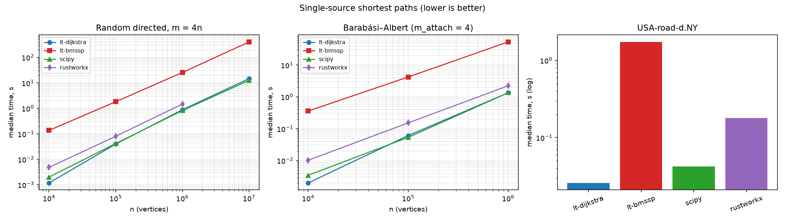

# BENCHMARKS — logtwothirds (Dijkstra & BMSSP) vs SciPy vs rustworkx

**TL;DR (honest): BMSSP loses on wall-clock time everywhere we measured — by
27×–114× against this crate's own Dijkstra — and the gap, while it narrows
with n exactly as the theory predicts, extrapolates to a crossover so far
beyond any storable graph that it will never be reached in practice. The
value of this BMSSP implementation is fidelity and instrumentation, not
speed. `lt-dijkstra` is competitive with SciPy (±15% on synthetic graphs,
1.6× faster on the NY road network) and 1.7–6.9× faster than rustworkx.**

Everything below was measured with `benchmarks/run.py` on the final,
optimized code (commit state of 2026-06-12), on a **portable** release build
(no `target-cpu=native` — see [Build portability](#build-portability)).

---

## Setup

| | |
|---|---|
| CPU | Intel Core i7-3635QM (Ivy Bridge, 2.4 GHz, 4C/8T) |
| RAM | 16 GB |
| OS | Windows 11 Pro |
| Python | 3.14.3 · NumPy 2.4.6 · SciPy 1.17.1 · rustworkx 0.17.1 |
| Rust | release profile: `opt-level=3`, `lto=fat`, `codegen-units=1`, mimalloc |

Methodology (`benchmarks/run.py`):

* **median of 5 runs** after 1 warmup run, `time.perf_counter`, GC disabled
  inside the timed region;
* **fixed seeds** for graph generation (`0xC0FFEE`, `0xBA0BAB`) and for the
  BMSSP pivot RNG (`seed=0`);
* **only the algorithm call is timed** — graph generation and per-library
  format conversion (CSR triple / `scipy.sparse.csr_array` / `PyDiGraph`)
  happen beforehand;
* distances of all four implementations are cross-checked per graph
  (`np.allclose`, rtol 1e-9); **every cell below passed**.

Comparability caveats, stated up front:

* `lt-bmssp`'s time *includes* its constant-degree transform — that is part
  of the algorithm's own pipeline, not a format conversion (it is ~2% of its
  time at n=10⁶, so it does not change any conclusion). It also includes
  building the settlement log (Step E instrumentation that ships in the
  production path).
* `lt-dijkstra` and `lt-bmssp` return distances **and** predecessors; the
  scipy call is `dijkstra(csr, directed=True, indices=source,
  return_predecessors=False)` (its natural fast form); rustworkx
  (`dijkstra_shortest_path_lengths`) returns distances of reachable vertices
  only and pays a per-edge Python `float()` cost for edge weights — its
  natural API has no way to avoid that.

## Results

### 1. Random directed graphs, m = 4n (weights U[0.01, 1))

| n | m | lt-dijkstra | lt-bmssp | scipy | rustworkx | bmssp / lt-dijkstra |
|---:|---:|---:|---:|---:|---:|---:|
| 10⁴ | 39,991 | **1.2 ms** | 137.4 ms | 2.0 ms | 4.9 ms | 114× |
| 10⁵ | 399,996 | **40.0 ms** | 1.83 s | 42.0 ms | 80.8 ms | 46× |
| 10⁶ | 3,999,995 | 885.7 ms | 25.55 s | **826.6 ms** | 1.48 s | 29× |
| 10⁷ | 39,999,994 | 14.75 s | 405.1 s | **12.60 s** | — ¹ | 27× |

¹ rustworkx skipped at n=10⁷: a 4×10⁷-edge `PyDiGraph` (one Python object
per edge) exceeds this machine's memory/time budget. The harness flag
`--rustworkx-max-edges` controls the cutoff; the skip is reported, not
hidden.

### 2. Barabási–Albert graphs (attachment 4, symmetrized → directed)

| n | m (arcs) | lt-dijkstra | lt-bmssp | scipy | rustworkx | bmssp / lt-dijkstra |
|---:|---:|---:|---:|---:|---:|---:|
| 10⁴ | 79,974 | **2.0 ms** | 359.8 ms | 3.5 ms | 10.3 ms | 180× |
| 10⁵ | 799,974 | 61.2 ms | 4.22 s | **53.7 ms** | 153.0 ms | 69× |
| 10⁶ | 7,999,974 | **1.35 s** | 53.31 s | 1.35 s | 2.24 s | 39× |

The heavy-tailed degree distribution is *worse* for BMSSP than the uniform
family: the constant-degree transform replaces each vertex of degree d with
a d-vertex zero-weight cycle, so hubs become long cycles that the algorithm
must walk edge by edge.

### 3. DIMACS USA-road-d.NY

9th DIMACS Challenge distance graph, New York City road network
(`benchmarks/run.py --families dimacs`, source = vertex 0; distances of all
four implementations cross-checked, no mismatches):

| graph | n | m | lt-dijkstra | lt-bmssp | scipy | rustworkx | bmssp / lt-dijkstra |
|---|---:|---:|---:|---:|---:|---:|---:|
| USA-road-d.NY | 264,346 | 730,100 | **25.7 ms** | 1.74 s | 42.3 ms | 178.4 ms | 68× |

Two observations. First, `lt-dijkstra` does *better* here than on the
synthetic families — 1.6× faster than SciPy and 6.9× faster than rustworkx —
the low degree (≈2.8 avg) and real-distance weights are a friendly shape for
a binary heap. Second, an earlier draft of this document predicted bmssp
would trail by "roughly 20–40×" because the low degree makes the
constant-degree transform nearly free; the measured ratio is **68×**, worse
than predicted. The transform is indeed cheap here, but the road network's
large diameter means the algorithm settles vertices in many small frontiers,
so the per-call recursion overhead (the dominant cost identified in the
profile below) is amortized over even less useful work than on the
small-diameter synthetic graphs. The prediction was wrong in the direction
that *strengthens* the overall conclusion.

### Log-log plot



(`benchmarks/results/benchmark_loglog.png`; raw numbers in `results.json`,
generated table in `results.md`.)

---

## Where the time goes in BMSSP: the three hottest functions

Measured with the built-in phase timer (`--features phase-timer`, zero
overhead when off):

```
cargo run --release --features phase-timer --example profile_phases -- 1000000
```

Random graph, n=10⁶ → transformed graph n₂≈8.0M, parameters k=2, t=8, L=3.
**Before** any optimization (total 49.8 s):

| rank | function | time | share |
|---|---|---:|---:|
| 1 | `BlockDs::pull` (quickselect + block scan) | 10.4 s | 20.9% |
| 2 | `find_pivots` (Algorithm 1) | 7.2 s | 14.5% |
| 3 | `base_case` (Algorithm 2, mini-Dijkstra) | 7.1 s | 14.2% |
| — | unattributed recursion body (sets, batch bookkeeping) | 16.0 s | 32.1% |

The operation counters explain *why*: with the production parameters the
recursion degenerates into enormous call counts on tiny inputs —
**4.34 M `pull` calls, 4.33 M `base_case` calls** (M=1 at level 1, k=2),
68.7 M edge scans for a 4 M-edge input graph. The cost is not one hot loop;
it is millions of tiny heap/map/Vec lifecycles.

## Optimizations: proposed, applied, rejected

Rule followed throughout (as required): **the Step E differential test
(`cargo test --test differential` — 200 graphs, bit-exact distances AND
settlement order vs the pinned Python reference) was run after every single
optimization and stayed green every time.** Only behavior-neutral changes
are legal: nothing may alter an RNG draw, an observable iteration order, or
a float operation order.

Applied (cumulative, phase-timer build, n=10⁶ random):

| # | change | total after | Δ | Step E |
|---|---|---:|---:|---|
| 0 | baseline | 49.8 s | — | green |
| 1 | FxHash instead of SipHash for every internal map/set (iteration order of these containers is never observed) | 40.1 s | −19% | green |
| 2 | `base_case` scratch reuse (`BaseCaseScratch`: heap + `best` + `in_u0` recycled across 4.3 M calls via `mem::take`) | 37.6 s | −6% | green |
| 3 | `BlockDs::pull`: reusable union buffer + in-place quickselect (`partition_smallest_in_place`, identical swap/`randint` sequence; the discarded "rest" half is no longer materialized) | 34.7 s | −8% | green |
| 4 | mimalloc as global allocator (the ~30 M small short-lived allocations per run are the Windows heap's worst case) | 27.2 s | −22% | green |

Net: **49.8 s → 27.2 s (−45%)**. Confirmed end-to-end from Python: the
n=10⁵ random cell went 3.10 s → 1.83 s, n=10⁴ 277 ms → 137 ms.

After optimization the top-3 are `find_pivots` (20.1%), the Algorithm-3
relaxation loop (16.4%), and `base_case` (11.3%), with the unattributed
recursion body still ~32% — i.e. the remaining cost is intrinsic recursion
overhead, not any single fixable hotspot.

Proposed but **not** applied (and why):

* **Epoch-stamped membership arrays** replacing the `w_set`/`u_set`/`in_u0`
  hash sets: behavior-neutral and likely another ~10%, but costs two extra
  n₂-sized arrays (≈640 MB at n=10⁷) — a bad trade at the sizes where bmssp
  is already memory-hungry.
* **Per-level Vec pools** for the per-pull `si_fresh`/`kk`/`prepend`
  buffers: the borrow gymnastics across recursion levels add real
  complexity for a cost mimalloc already cut to ~1 s.
* **Skipping the settlement log in non-instrumented runs**: legal (dist/pred
  unchanged) but worth <2%; not worth forking the API contract that Step E
  and the instrumented binding rely on.
* Anything touching the quickselect, set orders, or relaxation order:
  **forbidden** — it would change the settlement log and break the Step E
  contract even where distances stay correct.

## PGO evaluation

Two-phase build with `-Cprofile-generate` → `llvm-profdata merge` →
`-Cprofile-use` (rustup llvm-tools), workload = the profiler example at
n=3×10⁵ and 10⁶, then timed back-to-back against the non-PGO build:

| build | n=10⁶ run 1 | run 2 |
|---|---:|---:|
| baseline (lto=fat, cgu=1) | 27.36 s | 28.01 s |
| PGO | 26.62 s | 26.82 s |

**≈3% improvement.** Real but marginal on top of fat LTO + single codegen
unit, and it would complicate the wheel build (instrumented build + a
representative training run on every build host). **Not adopted**; the
published numbers are from the ordinary release build. Worth revisiting
only if a CI pipeline ships prebuilt wheels.

## Parallel multi-source API (rayon)

New in this change set: `multi_source_shortest_paths(graph, sources,
method="dijkstra"|"bmssp")` → `(k, n)` distance and predecessor matrices.
Sources fan out over a rayon pool; each row is **bit-identical** to the
corresponding single-source call (asserted by `tests/test_multi_source.py`
and Rust unit tests — row results don't depend on scheduling).

Measured (n=10⁶, m=4×10⁶, 8 sources, dijkstra): sequential 7.23 s →
parallel **1.75 s, a 4.1× speedup on 4 physical cores**. Note for
`method="bmssp"`: each in-flight source holds its own transformed graph, so
peak memory scales with `min(k, n_threads)` × single-run footprint.

## Build portability

`.cargo/config.toml` previously forced `-C target-cpu=native` on **every**
build, silently making any built wheel host-specific. That default is
removed: release builds are now portable x86-64 (the same guarantee SciPy
and rustworkx wheels give), `_mm_prefetch` in the Dijkstra hot loop is
baseline-SSE and unaffected. Host tuning remains available as an explicit
opt-in:

```
RUSTFLAGS="-C target-cpu=native" maturin develop --release
```

All numbers in this document are from the **portable** build.

## Honest conclusion

**Where bmssp loses: everywhere, on every graph family and size we
measured** — 27×–114× slower than this crate's Dijkstra on uniform random
graphs, 39×–180× on Barabási–Albert graphs, 68× on the USA-road-d.NY road
network. Three structural reasons:

1. **The constant-degree transform multiplies the problem.** A 4 M-edge
   graph becomes an 8 M-vertex, 12 M-edge graph before the algorithm
   proper starts; BMSSP then performs ~69 M edge scans and ~51 M
   relaxations where Dijkstra needs one scan per edge (4 M) plus cheap heap
   traffic.
2. **The theoretical machinery has a huge constant.** At realistic sizes
   the parameters degenerate (k=2, t=8, M=1 at the bottom level), so the
   recursion executes millions of single-vertex `pull`/`base_case` episodes
   whose bookkeeping dwarfs the useful relaxation work. After removing 45%
   of the constant with behavior-preserving engineering, a third of the
   runtime is still recursion bookkeeping that cannot be attributed to any
   single function.
3. **The asymptotic advantage is real but glacial.** The ratio
   bmssp/dijkstra falls 114× → 46× → 29× → 27× from n=10⁴ to 10⁷ — the
   measured times fit T_bmssp/T_dij ≈ C·log₂(n)^(−1/3) with C ≈ 78, exactly
   the O(m log^(2/3) n) vs O(m log n) prediction. Extrapolated, the curves
   cross near log₂ n ≈ C³ ≈ 4.8×10⁵, i.e. n ≈ 2^480000 — a graph that
   cannot exist in this universe. "Breaking the sorting barrier" is an
   asymptotic statement, and these measurements are consistent with it
   *while showing it buys nothing at feasible scales*.

**Where bmssp wins:** not on wall-clock time, on any input we could
construct or store. What this implementation does win is (a) a verified,
bit-exact executable model of the Duan–Mao–Mao–Shu–Yin algorithm with
deterministic settlement logs and operation counters — useful for studying
the algorithm itself — and (b) the scaling-trend confirmation above, which
is only credible because the implementation is differential-tested against
the reference rather than tuned until "fast enough to look right".

**Practical guidance:** use `shortest_paths(..., method="dijkstra")` (or
`multi_source_shortest_paths` for batches — 4× on 4 cores). It matches or
beats SciPy up to 10⁶ vertices (SciPy is 7–15% faster at 10⁶–10⁷ on this
machine; on the NY road network lt-dijkstra is 1.6× faster), beats
rustworkx 1.7–6.9×, and returns predecessors at no extra charge. Keep
`method="bmssp"` for instrumentation and research.

---

### Reproducing

```bash
# build (portable) and run the suite
.venv/Scripts/maturin develop --release
.venv/Scripts/python benchmarks/run.py                 # full, ~1 h
.venv/Scripts/python benchmarks/run.py --quick         # smoke
# phase profile
cargo run --release --features phase-timer --example profile_phases -- 1000000
# the gate every optimization must pass
cargo test --test differential
```
