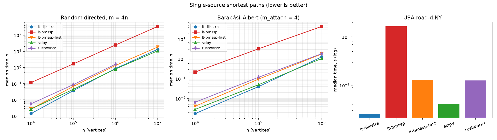

# BENCHMARKS — logtwothirds (Dijkstra & BMSSP) vs SciPy vs rustworkx

**TL;DR (honest): BMSSP loses on wall-clock time everywhere we measured.
The faithful implementation (`method="bmssp"`) trails this crate's own
Dijkstra by 26×–128×. The best BMSSP instantiation we could build
(`method="bmssp-fast"`, the endpoint of the VARIANTS.md study plus a
low-level engineering pass) closes that to 1.4×–5.0× — and still loses
everywhere, with every trend pointing away from a crossover at any storable
size. Accordingly, `method="auto"` selects Dijkstra always. The value of
the BMSSP implementations is fidelity, instrumentation, and the measured
verdict itself — not speed. `lt-dijkstra` is competitive with SciPy
(1.2–1.9× faster up to 10⁵, 6–25% slower at 10⁶–10⁷, 1.6× faster on the NY
road network) and 1.5–4.9× faster than rustworkx.**

Everything below was measured with `benchmarks/run.py --tag final` on the
final, consolidated code (commit state of 2026-06-13), on a **portable**
release build (no `target-cpu=native` — see
[Build portability](#build-portability)). Raw numbers:
`benchmarks/results/results_final.{json,md}`. All five implementations were
re-timed in one session, so every ratio is internally consistent.

---

## Setup

| | |
|---|---|
| CPU | Intel Core i7-3635QM (Ivy Bridge, 2.4 GHz, 4C/8T) |
| RAM | 16 GB |
| OS | Windows 11 Pro |
| Python | 3.14.3 · NumPy 2.4.6 · SciPy 1.17.1 · rustworkx 0.17.1 |
| Rust | release profile: `opt-level=3`, `lto=fat`, `codegen-units=1`, mimalloc |

Methodology (`benchmarks/run.py`):

* **median of 5 runs** after 1 warmup run, `time.perf_counter`, GC disabled
  inside the timed region;
* **fixed seeds** for graph generation (`0xC0FFEE`, `0xBA0BAB`) and for the
  BMSSP pivot RNG (`seed=0`);
* **only the algorithm call is timed** — graph generation and per-library
  format conversion (CSR triple / `scipy.sparse.csr_array` / `PyDiGraph`)
  happen beforehand;
* distances of all five implementations are cross-checked per graph
  (`np.allclose`, rtol 1e-9); **every cell below passed**.

The five implementations:

| column | what it is |
|---|---|
| lt-dijkstra | this crate, `method="dijkstra"` (= what `method="auto"` selects) |
| lt-bmssp | this crate, `method="bmssp"` — faithful to the paper (transform, paper (k, t), block queue, pinned settlement order) |
| lt-bmssp-fast | this crate, `method="bmssp-fast"` — the minimal BMSSP instantiation (VARIANTS.md) after the consolidation pass |
| scipy | `scipy.sparse.csgraph.dijkstra` |
| rustworkx | `rustworkx.dijkstra_shortest_path_lengths` |

Comparability caveats, stated up front:

* `lt-bmssp`'s time *includes* its constant-degree transform — that is part
  of the algorithm's own pipeline, not a format conversion (it is ~2% of its
  time at n=10⁶, so it does not change any conclusion). It also includes
  building the settlement log (Step E instrumentation that ships in the
  production path). `lt-bmssp-fast` has neither (no transform; instrumentation
  compiled out unless `--features phase-timer`).
* `lt-dijkstra`, `lt-bmssp` and `lt-bmssp-fast` return distances **and**
  predecessors; the scipy call is `dijkstra(csr, directed=True,
  indices=source, return_predecessors=False)` (its natural fast form);
  rustworkx (`dijkstra_shortest_path_lengths`) returns distances of
  reachable vertices only and pays a per-edge Python `float()` cost for edge
  weights — its natural API has no way to avoid that.

## Results

### 1. Random directed graphs, m = 4n (weights U[0.01, 1))

| n | m | lt-dijkstra | lt-bmssp | lt-bmssp-fast | scipy | rustworkx | bmssp / dij | fast / dij |
|---:|---:|---:|---:|---:|---:|---:|---:|---:|
| 10⁴ | 39,991 | **1.4 ms** | 117.3 ms | 2.7 ms | 2.7 ms | 5.7 ms | 84× | 1.9× |
| 10⁵ | 399,996 | **36.9 ms** | 1.66 s | 67.4 ms | 44.6 ms | 87.1 ms | 45× | 1.8× |
| 10⁶ | 3,999,995 | 854.4 ms | 24.61 s | 1.34 s | **805.5 ms** | 1.59 s | 29× | 1.6× |
| 10⁷ | 39,999,994 | 13.30 s | 345.1 s | 18.40 s | **10.69 s** | — ¹ | 26× | 1.4× |

¹ rustworkx skipped at n=10⁷: a 4×10⁷-edge `PyDiGraph` (one Python object
per edge) exceeds this machine's memory/time budget. The harness flag
`--rustworkx-max-edges` controls the cutoff; the skip is reported, not
hidden.

### 2. Barabási–Albert graphs (attachment 4, symmetrized → directed)

| n | m (arcs) | lt-dijkstra | lt-bmssp | lt-bmssp-fast | scipy | rustworkx | bmssp / dij | fast / dij |
|---:|---:|---:|---:|---:|---:|---:|---:|---:|
| 10⁴ | 79,974 | **1.7 ms** | 217.3 ms | 4.1 ms | 2.8 ms | 6.5 ms | 128× | 2.4× |
| 10⁵ | 799,974 | **40.0 ms** | 3.25 s | 95.5 ms | 49.9 ms | 118.4 ms | 81× | 2.4× |
| 10⁶ | 7,999,974 | 1.28 s | 43.86 s | 1.79 s | **1.06 s** | 1.86 s | 34× | 1.4× |

The heavy-tailed degree distribution is *worse* for the faithful BMSSP than
the uniform family: the constant-degree transform replaces each vertex of
degree d with a d-vertex zero-weight cycle, so hubs become long cycles that
the algorithm must walk edge by edge. `lt-bmssp-fast` skips the transform,
which is exactly why its BA penalty (1.4–2.4×) looks like its random-graph
penalty instead of inheriting the faithful one (34–128×).

### 3. DIMACS USA-road-d.NY

9th DIMACS Challenge distance graph, New York City road network
(`benchmarks/run.py --families dimacs`, source = vertex 0; distances of all
five implementations cross-checked, no mismatches):

| graph | n | m | lt-dijkstra | lt-bmssp | lt-bmssp-fast | scipy | rustworkx | bmssp / dij | fast / dij |
|---|---:|---:|---:|---:|---:|---:|---:|---:|---:|
| USA-road-d.NY | 264,346 | 730,100 | **25.9 ms** | 1.65 s | 130.5 ms | 40.7 ms | 125.8 ms | 64× | 5.0× |

Three observations. First, `lt-dijkstra` does *better* here than on the
synthetic families — 1.6× faster than SciPy and 4.9× faster than rustworkx —
the low degree (≈2.8 avg) and real-distance weights are a friendly shape for
a heap. Second, an earlier draft of this document predicted the faithful
bmssp would trail by "roughly 20–40×" because the low degree makes the
constant-degree transform nearly free; the measured ratio is **64×**, worse
than predicted: the road network's large diameter means the algorithm
settles vertices in many small frontiers, so the per-call recursion
overhead is amortized over even less useful work than on the small-diameter
synthetic graphs. The prediction was wrong in the direction that
*strengthens* the overall conclusion. Third, the road graph is also
`lt-bmssp-fast`'s worst case (5.0× vs 1.4–2.4× elsewhere): its integer
weights produce massive path-length ties, and bmssp-fast pays for every tie
with the full lexicographic `(len, hops, id)` comparison and the extra
relaxations the `<=` rule implies — the contract it must keep to be a BMSSP
oracle.

### Log-log plot



(`benchmarks/results/benchmark_loglog_final.png`; raw numbers in
`results_final.json`, generated table in `results_final.md`.)

---

## Where the time goes in BMSSP: the three hottest functions

Measured with the built-in phase timer (`--features phase-timer`, zero
overhead when off):

```
cargo run --release --features phase-timer --example profile_phases -- 1000000
```

Random graph, n=10⁶ → transformed graph n₂≈8.0M, parameters k=2, t=8, L=3.
**Before** any optimization (total 49.8 s):

| rank | function | time | share |
|---|---|---:|---:|
| 1 | `BlockDs::pull` (quickselect + block scan) | 10.4 s | 20.9% |
| 2 | `find_pivots` (Algorithm 1) | 7.2 s | 14.5% |
| 3 | `base_case` (Algorithm 2, mini-Dijkstra) | 7.1 s | 14.2% |
| — | unattributed recursion body (sets, batch bookkeeping) | 16.0 s | 32.1% |

The operation counters explain *why*: with the production parameters the
recursion degenerates into enormous call counts on tiny inputs —
**4.34 M `pull` calls, 4.33 M `base_case` calls** (M=1 at level 1, k=2),
68.7 M edge scans for a 4 M-edge input graph. The cost is not one hot loop;
it is millions of tiny heap/map/Vec lifecycles.

## Optimizations: proposed, applied, rejected

This section is the **mainline faithful `bmssp`** optimization pass. The
parallel pass on the **`bmssp-fast` variant** (a different engine under a
different gate, 2.13 s → 1.21 s at n=10⁶) is recorded in **OPTIMIZATION.md**;
the two do not overlap.

Rule followed throughout (as required): **the Step E differential test
(`cargo test --test differential` — 200 graphs, bit-exact distances AND
settlement order vs the pinned Python reference) was run after every single
optimization and stayed green every time.** Only behavior-neutral changes
are legal: nothing may alter an RNG draw, an observable iteration order, or
a float operation order.

Applied (cumulative, phase-timer build, n=10⁶ random):

| # | change | total after | Δ | Step E |
|---|---|---:|---:|---|
| 0 | baseline | 49.8 s | — | green |
| 1 | FxHash instead of SipHash for every internal map/set (iteration order of these containers is never observed) | 40.1 s | −19% | green |
| 2 | `base_case` scratch reuse (`BaseCaseScratch`: heap + `best` + `in_u0` recycled across 4.3 M calls via `mem::take`) | 37.6 s | −6% | green |
| 3 | `BlockDs::pull`: reusable union buffer + in-place quickselect (`partition_smallest_in_place`, identical swap/`randint` sequence; the discarded "rest" half is no longer materialized) | 34.7 s | −8% | green |
| 4 | mimalloc as global allocator (the ~30 M small short-lived allocations per run are the Windows heap's worst case) | 27.2 s | −22% | green |

Net: **49.8 s → 27.2 s (−45%)**. Confirmed end-to-end from Python: the
n=10⁵ random cell went 3.10 s → 1.83 s, n=10⁴ 277 ms → 137 ms.

After optimization the top-3 are `find_pivots` (20.1%), the Algorithm-3
relaxation loop (16.4%), and `base_case` (11.3%), with the unattributed
recursion body still ~32% — i.e. the remaining cost is intrinsic recursion
overhead, not any single fixable hotspot.

Proposed but **not** applied (and why):

* **Epoch-stamped membership arrays** replacing the `w_set`/`u_set`/`in_u0`
  hash sets: behavior-neutral and likely another ~10%, but costs two extra
  n₂-sized arrays (≈640 MB at n=10⁷) — a bad trade at the sizes where bmssp
  is already memory-hungry.
* **Per-level Vec pools** for the per-pull `si_fresh`/`kk`/`prepend`
  buffers: the borrow gymnastics across recursion levels add real
  complexity for a cost mimalloc already cut to ~1 s.
* **Skipping the settlement log in non-instrumented runs**: legal (dist/pred
  unchanged) but worth <2%; not worth forking the API contract that Step E
  and the instrumented binding rely on.
* Anything touching the quickselect, set orders, or relaxation order:
  **forbidden** — it would change the settlement log and break the Step E
  contract even where distances stay correct.

## bmssp-fast: how far engineering can push BMSSP

`method="bmssp-fast"` is the endpoint of two efforts documented in
VARIANTS.md: the algorithm-level variant study (no constant-degree
transform + bounded multi-source Dijkstra oracle (D=1, B=1024) + flat heap
+ tuned (k=1, t=12) — each delta verified against the paper's correctness
lemmas) and a final low-level consolidation pass (hash-free oracles with
epoch-stamped membership, a structure-of-arrays 4-ary heap in exact `Key`
order, fused 16-byte labels; 2.13 s → 1.21 s at n=10⁶, every step gated on
the 520-graph + 10⁶-edge bit-exactness suite — full record in
**OPTIMIZATION.md**). Its distances are bit-exact vs Dijkstra on every graph
in that suite and cross-checked in every benchmark cell above.

Two honest disclosures about what it is:

1. **Structurally, a single-source bmssp-fast run is one bounded
   multi-source Dijkstra call.** At the tuned parameters the hybrid oracle
   rule (|S| ≤ 1024) already fires at the root, so the run executes zero
   FindPivots calls and zero queue pulls (phase profile:
   `examples/profile_fast.rs`). The variant study's tuning gradients all
   pointed toward Dijkstra, and the measured optimum *is* Dijkstra —
   carrying BMSSP's lexicographic `(len, hops, id)` labels, `<=` relaxation
   rule, and bound checks. That label/contract overhead is precisely the
   residual 1.4–5.0× gap.
2. **It exists to make the verdict sharp, not to be used.** The
   interesting number it produces is: even after deleting every cost the
   correctness lemmas allow to be deleted, the BMSSP framework still loses
   to plain Dijkstra everywhere measured.

Gap-vs-n, both engines (random m = 4n):

| ratio to lt-dijkstra | 10⁴ | 10⁵ | 10⁶ | 10⁷ |
|---|---:|---:|---:|---:|
| lt-bmssp (faithful) | 84× | 45× | 29× | 26× |
| lt-bmssp-fast | 1.9× | 1.8× | 1.6× | 1.4× |

## PGO evaluation

Two-phase build with `-Cprofile-generate` → `llvm-profdata merge` →
`-Cprofile-use` (rustup llvm-tools), workload = the profiler example at
n=3×10⁵ and 10⁶, then timed back-to-back against the non-PGO build:

| build | n=10⁶ run 1 | run 2 |
|---|---:|---:|
| baseline (lto=fat, cgu=1) | 27.36 s | 28.01 s |
| PGO | 26.62 s | 26.82 s |

**≈3% improvement.** Real but marginal on top of fat LTO + single codegen
unit, and it would complicate the wheel build (instrumented build + a
representative training run on every build host). **Not adopted**; the
published numbers are from the ordinary release build. Worth revisiting
only if a CI pipeline ships prebuilt wheels.

## Parallel multi-source API (rayon)

`shortest_paths_multi(graph, sources, method="auto"|"dijkstra"|"bmssp")`
(formerly `multi_source_shortest_paths`) → `(k, n)` distance and
predecessor matrices.
Sources fan out over a rayon pool; each row is **bit-identical** to the
corresponding single-source call (asserted by `tests/test_multi_source.py`
and Rust unit tests — row results don't depend on scheduling).

Measured (n=10⁶, m=4×10⁶, 8 sources, dijkstra): sequential 7.23 s →
parallel **1.75 s, a 4.1× speedup on 4 physical cores**. Note for
`method="bmssp"`: each in-flight source holds its own transformed graph, so
peak memory scales with `min(k, n_threads)` × single-run footprint.

## Build portability

`.cargo/config.toml` previously forced `-C target-cpu=native` on **every**
build, silently making any built wheel host-specific. That default is
removed: release builds are now portable x86-64 (the same guarantee SciPy
and rustworkx wheels give), `_mm_prefetch` in the Dijkstra hot loop is
baseline-SSE and unaffected. Host tuning remains available as an explicit
opt-in:

```
RUSTFLAGS="-C target-cpu=native" maturin develop --release
```

All numbers in this document are from the **portable** build.

## Honest conclusion

**Where bmssp loses: everywhere, on every graph family and size we
measured.** The faithful engine trails this crate's Dijkstra 26×–84× on
uniform random graphs, 34×–128× on Barabási–Albert graphs, 64× on the
USA-road-d.NY road network. The maximally-engineered `bmssp-fast` trails
1.4×–1.9× on random, 1.4×–2.4× on BA, 5.0× on the road network. Three
structural reasons for the faithful gap:

1. **The constant-degree transform multiplies the problem.** A 4 M-edge
   graph becomes an 8 M-vertex, 12 M-edge graph before the algorithm
   proper starts; BMSSP then performs ~69 M edge scans and ~51 M
   relaxations where Dijkstra needs one scan per edge (4 M) plus cheap heap
   traffic.
2. **The theoretical machinery has a huge constant.** At realistic sizes
   the parameters degenerate (k=2, t=8, M=1 at the bottom level), so the
   recursion executes millions of single-vertex `pull`/`base_case` episodes
   whose bookkeeping dwarfs the useful relaxation work. After removing 45%
   of the constant with behavior-preserving engineering, a third of the
   runtime is still recursion bookkeeping that cannot be attributed to any
   single function.
3. **The asymptotic advantage is real but glacial.** The faithful ratio
   falls 84× → 45× → 29× → 26× from n=10⁴ to 10⁷, consistent with the
   O(m log^(2/3) n) vs O(m log n) prediction
   T_bmssp/T_dij ≈ C·log₂(n)^(−1/3); the fitted C drifts down to ≈74–79 at
   the largest sizes. Extrapolated, the curves cross near
   log₂ n ≈ C³ ≈ 4×10⁵, i.e. **n ≈ 2^400,000** — a graph that cannot exist
   in this universe. "Breaking the sorting barrier" is an asymptotic
   statement, and these measurements are consistent with it *while showing
   it buys nothing at feasible scales*.

**And no crossover exists for bmssp-fast either.** Its ratio falls
1.9× → 1.8× → 1.6× → 1.4× over the same range, but the extrapolation is
even less favorable than it looks: structurally (see above) bmssp-fast *is*
a Dijkstra run carrying BMSSP's heavier labels, so its gap is a per-edge
constant-factor cost (16-byte lexicographic labels vs 8-byte distances,
i64 hop arithmetic in every comparison, larger heap entries) that does not
vanish with n — the honest model is a plateau ≥ ~1.3×, not a crossing.
Even force-fitting the paper's C·log₂(n)^(−1/3) form to the measured points
(C ≈ 4.0–4.6) puts the nominal crossing at log₂ n ≈ 64–97, i.e.
n ≈ 10^19–10^29 — beyond any storable graph. Both readings give the same
verdict: **there is no size at which selecting any BMSSP engine over
Dijkstra pays, which is why `method="auto"` selects Dijkstra always.**

**Where bmssp wins:** not on wall-clock time, on any input we could
construct or store. What this implementation does win is (a) a verified,
bit-exact executable model of the Duan–Mao–Mao–Shu–Yin algorithm with
deterministic settlement logs and operation counters — useful for studying
the algorithm itself; (b) the scaling-trend confirmation above, which is
only credible because the implementation is differential-tested against
the reference rather than tuned until "fast enough to look right"; and
(c) via the variant ladder, a measured decomposition of *where* the
slowdown lives (transform ≈ 8–11×, recursion machinery ≈ the rest) ending
in the sharpest possible statement of the verdict (`bmssp-fast`).

**Practical guidance:** use `shortest_paths(graph, source)` — the default
`method="auto"` selects Dijkstra, always (or `shortest_paths_multi` for
batches — 4× on 4 cores). It matches or beats SciPy up to 10⁵ vertices
(SciPy is 6–25% faster at 10⁶–10⁷ on this machine; on the NY road network
lt-dijkstra is 1.6× faster), beats rustworkx 1.5–4.9×, and returns
predecessors at no extra charge. `method="bmssp"` (faithful, instrumented)
and `method="bmssp-fast"` / `method="bmssp-<variant>"` (research engines)
are for studying the algorithm, with the honest numbers above.

---

### Reproducing

```bash
# build (portable) and run the suite
.venv/Scripts/maturin develop --release
.venv/Scripts/python benchmarks/run.py --tag final     # full, ~1.5 h
.venv/Scripts/python benchmarks/run.py --quick         # smoke
# phase profiles (mainline / bmssp-fast)
cargo run --release --features phase-timer --example profile_phases -- 1000000
cargo run --release --features phase-timer --example profile_fast -- 1000000
# the gates every optimization must pass
cargo test --test differential                          # mainline (order-exact)
cargo test --release --test variants_correctness        # variants (bit-exact dist)
```
